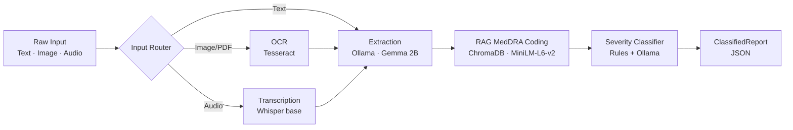

# VIGIL: AI-Powered Adverse Event Report Classifier

> Local-first pharmacovigilance tool that classifies adverse drug events and maps symptoms to MedDRA codes.


---

## Problem Statement

The U.S. FDA receives **over one million adverse event reports per year** through its FAERS system, and the EMA receives comparable volumes via EudraVigilance. Each report arrives as free-text narrative — written by physicians, nurses, pharmacists, and patients — and must be converted into structured, standards-compliant data before it can be used for signal detection. A trained pharmacovigilance specialist typically spends **15–30 minutes per report** reading the narrative, identifying the suspect drug, extracting reactions, mapping each symptom to the ~80,000-term MedDRA dictionary, and classifying the case against the six FDA seriousness criteria.

This manual workflow is the bottleneck of drug-safety surveillance. VIGIL automates it using a local LLM combined with retrieval-augmented generation over a MedDRA vector index. The entire pipeline runs **100% on-device** — adverse event reports contain protected health information, and a local-only tool is genuinely more appropriate for this domain than a cloud-dependent one. No API keys, no cloud services, no usage billing.

---

## Features

- 🔬 **Structured extraction** — patient demographics, suspect drugs, concomitant drugs, reactions, onset timeline, outcomes, reporter
- 🧬 **MedDRA coding** — RAG retrieval over 400+ curated Preferred Terms with layperson synonyms, LLM-assisted disambiguation
- ⚖️ **Severity classification** — rules engine for the six FDA seriousness criteria, LLM fallback for ambiguous negated contexts
- 📥 **Multi-modal input** — paste text, upload a photo/PDF (Tesseract OCR), or upload an audio dictation (local Whisper)
- 📊 **Streamlit UI** — single-report mode, batch CSV processing, session dashboard with plotly charts
- 🔒 **100% local** — no API keys, no cloud calls, no PHI leaves the machine

---

## Architecture



---

## Tech Stack

| Component | Choice | Why |
|---|---|---|
| Language | Python 3.11+ | Mature ML ecosystem |
| LLM | Ollama + `gemma2:2b` | Runs on 8GB RAM, no API key |
| Embeddings | `all-MiniLM-L6-v2` (ONNX) | 384-dim, no torch dependency |
| Vector DB | ChromaDB (persistent) | Simple, file-backed |
| OCR | Tesseract + pytesseract | Free, local, accurate for print |
| Speech-to-text | OpenAI Whisper (`base`) | Local, 140MB, no API key |
| UI | Streamlit + Plotly | Fast to iterate |
| Test data | OpenFDA FAERS API | Free, public, ground-truthed |

---

## Quick Start

### 1. Install system dependencies

```bash
# macOS
brew install ollama tesseract poppler ffmpeg

# Ubuntu / Debian
sudo apt-get install tesseract-ocr poppler-utils ffmpeg
curl -fsSL https://ollama.com/install.sh | sh
```

- **tesseract** → OCR for document uploads
- **poppler** → PDF page rendering (used by `pdf2image`)
- **ffmpeg** → audio decoding (used by Whisper)

### 2. Pull the Gemma 2B model

```bash
ollama pull gemma2:2b
ollama serve   # runs on localhost:11434
```

### 3. Clone + install Python deps

```bash
git clone https://github.com/SuvayanR07/vigil-adverse-event-classifier.git
cd vigil-adverse-event-classifier
python3.11 -m venv venv && source venv/bin/activate
pip install -r requirements.txt
```

### 4. Build the data layer

```bash
python scripts/fetch_faers.py       # downloads 300 FAERS reports
python scripts/curate_meddra.py     # generates data/meddra_terms.json
python scripts/embed_meddra.py      # builds ChromaDB (~30s, one-time)
```

### 5. Run the app

```bash
streamlit run app.py
```

Opens at http://localhost:8501. If Ollama is reachable the app runs in **Live** mode; otherwise it falls back to **Demo** mode using pre-cached results.

> 📝 **Note:** the first time you upload audio, Whisper will download its `base` model (~140MB) to `~/.cache/whisper/`. Subsequent runs are instant.

---

## Validation Results

Measured against **50 FAERS reports with ground-truth MedDRA coding and seriousness flags**. The ground truth comes directly from FDA's coded dataset — narratives are fed in as text and the model's predictions are compared against the structured fields it cannot see.

| Metric | Result | Notes |
|---|---|---|
| Extraction rate | **100.0%** | every report yielded ≥ 1 coded reaction |
| Severity accuracy | **100.0%** | 50/50 serious events correctly flagged |
| SOC accuracy (on match) | **100.0%** | 100/100 matched PTs had correct System Organ Class |
| MedDRA PT precision | 64.3% | 115/179 predicted PTs matched ground truth |
| MedDRA PT recall | 58.3% | 105/180 ground-truth PTs recovered |
| MedDRA PT F1 | 0.611 | — |
| Avg latency | 18.4 s / report | CPU, Gemma 2B on M-series MacBook |

**Why precision/recall sits at ~60%:** VIGIL embeds a curated 400-term MedDRA subset, while FAERS ground-truth draws from the full ~80,000-term dictionary. Missed predictions are disproportionately terms like `DRUG ADMINISTRATION ERROR` and `PRODUCT USE ISSUE` — administrative events, not clinical reactions. A production deployment with the full MedDRA license would close most of this gap.

Full per-report results are saved to [`data/validation_results.json`](data/validation_results.json).

---

## Screenshots

| Classify tab | Results display | Dashboard |
|---|---|---|
| [SCREENSHOT_CLASSIFY] | [SCREENSHOT_RESULTS] | [SCREENSHOT_DASHBOARD] |

---

## Project Structure

```
vigil/
├── app.py                       # Streamlit UI (paste / image+PDF / audio input)
├── config.py                    # Paths, model names, thresholds
├── requirements.txt
├── pipeline/
│   ├── extractor.py             # Narrative → structured fields
│   ├── meddra_coder.py          # ChromaDB RAG + LLM selection
│   ├── severity.py              # FDA seriousness classifier
│   ├── ocr.py                   # Image + PDF OCR (Tesseract)
│   ├── transcriber.py           # Audio STT (Whisper)
│   ├── classify.py              # Pipeline orchestrator
│   ├── ollama_client.py         # Local LLM wrapper
│   └── schemas.py               # Pydantic models
├── scripts/
│   ├── fetch_faers.py           # OpenFDA FAERS download
│   ├── curate_meddra.py         # Hand-curated MedDRA subset
│   ├── embed_meddra.py          # ONNX MiniLM → ChromaDB
│   ├── validate.py              # 50-report accuracy test
│   ├── test_pipeline.py         # End-to-end smoke test
│   └── build_demo_results.py    # Pre-cache for Streamlit Cloud
└── data/
    ├── faers_samples.json
    ├── meddra_terms.json
    ├── test_narratives.json
    ├── demo_results.json
    └── validation_results.json
```

---

## Limitations

- **Curated MedDRA subset.** 400 Preferred Terms, not the full ~80,000. Reactions outside the curated set fall back to the nearest neighbor or fail to code.
- **2B-parameter model ceiling.** Gemma 2B can miss subtle extractions (e.g., collapsing "nausea and vomiting" into one reaction) that a 70B model would handle. A production deployment would use Llama 3.1 8B+ or a cloud API.
- **English only.** No multilingual extraction or MedDRA coding.
- **OCR quality varies.** Clean printed documents OCR well; handwriting and low-resolution phone photos may need manual cleanup in the editable review box.
- **Streamlit Cloud demo is text-only.** OCR and audio require system binaries (tesseract, poppler, ffmpeg) not available on Streamlit Cloud. Demo mode degrades gracefully with an install-locally message.

---

## Future Work

- Full MedDRA license → embed all ~80K PTs (closes the precision/recall gap)
- Swap Gemma 2B for Llama 3.1 8B or a cloud LLM (for organizations that permit it)
- Cross-encoder re-ranking on the top-5 RAG candidates (top-1 precision bump)
- **E2B R3 XML export** for direct submission to FDA FAERS / EMA EudraVigilance
- Fine-grained confidence calibration against expert-coded ground truth
- Batch clinical-trial CIOMS form ingestion

---

## License

MIT — see [LICENSE](LICENSE).

## Citation

If VIGIL is useful in your research or coursework, please cite:

```
@software{vigil_2026,
  author = {Rakshit, Suvayan},
  title  = {VIGIL: Local AI-Powered Adverse Event Report Classifier},
  year   = {2026},
  url    = {https://github.com/SuvayanR07/vigil-adverse-event-classifier}
}
```
