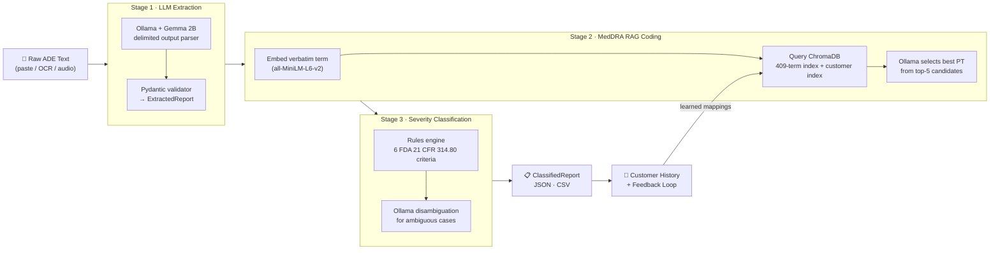

# 🩺 VIGIL: AI-Powered Adverse Event Report Classifier

### *Automate pharmacovigilance. Learn per-organization. Stay compliant.*

[](https://python.org)
[](https://streamlit.io)
[](https://ollama.ai)
[](https://www.trychroma.com)
[](LICENSE)
[](data/version.json)

**[GitHub →](https://github.com/SuvayanR07/Vigil)** &nbsp;|&nbsp; **[Portfolio →](https://suvayanrakshit.vercel.app)**


---

> *A pharmacovigilance analyst reads a paragraph of broken English from a patient who had a bad reaction to a drug. She must extract demographics, name the drugs, find the matching MedDRA code from a dictionary of 80,000 terms, judge whether it's an FDA-reportable serious event, and produce a structured dossier in under 30 minutes. Multiply that by a thousand reports a week. That's the problem VIGIL solves.*

---

## 📹 Demo

https://github.com/user-attachments/assets/d2a91b76-d78a-414a-ac70-2e2545f7c02a

> See VIGIL in action: paste a narrative, extract drugs and reactions, map to MedDRA codes, view severity classification, and correct results to improve future predictions.

---

## Contents

1. [The Problem](#1-the-problem)
2. [The Business Opportunity](#2-the-business-opportunity)
3. [How VIGIL Works](#3-how-vigil-works)
4. [Key Features](#4-key-features)
5. [Validation Results](#5-validation-results)
6. [Tech Stack](#6-tech-stack)
7. [Quick Start](#7-quick-start)
8. [Usage Guide](#8-usage-guide)
9. [Per-Customer Learning](#9-per-customer-learning)
10. [Architecture](#10-architecture)
11. [Validation Methodology](#11-validation-methodology)
12. [Limitations & Roadmap](#12-limitations--roadmap)
13. [Contributing](#13-contributing)
14. [Links](#14-links)


---

## 1. The Problem

The FDA receives over **1 million adverse event reports** every year. Behind each report is a patient who had an unexpected reaction to a drug, a rash, a seizure, a hospitalization, or worse. Turning that patient's words into a regulatory-compliant safety record is slow, expensive, and dangerously error-prone.

**What a pharmacovigilance coordinator does with each report:**

| Step | Task | Time |
|------|------|------|
| 1 | Extract patient demographics (age, sex, weight) | 2–3 min |
| 2 | Identify suspect and concomitant drugs, doses, routes | 3–5 min |
| 3 | Map each symptom to the correct MedDRA Preferred Term from 80,000+ codes | 8–12 min |
| 4 | Classify severity against 6 FDA seriousness criteria | 3–5 min |
| 5 | Write up the structured report and flag edge cases for medical review | 3–5 min |
| **Total** | | **15–30 min per report** |

**The cost of getting it wrong is severe.** Miscoded MedDRA terms or missed seriousness criteria can trigger FDA warning letters, consent decree proceedings, and reputational damage that takes years to recover from. Yet organizations are doing this manually, with humans, fatigue, and spreadsheets.

VIGIL replaces steps 1–5 with a sub-60-second automated pipeline that runs entirely on your machine.

---

## 2. The Business Opportunity

This is not a toy problem. It is a $500M+ annual pain point with no good open-source answer.

| Metric | Figure |
|--------|--------|
| Pharma organizations globally | 5,000+ |
| Average reports per mid-size company per year | 10,000–50,000 |
| Current cost (specialist coordinator salary) | $80,000–$120,000/year |
| VIGIL-driven time reduction per report | **20 min to under 1 min** |
| Estimated labor savings per org/year | **$30,000–$50,000** |
| Total addressable market | **$500M+/year** |

**Why existing tools fail:**

- **Argus Safety, ArisGlobal, Veeva Vault**: enterprise software at $200k+/year per license, SAP-level implementation timelines, and zero learning from your own data.
- **Manual coding**: scales linearly with headcount. As report volumes grow from FAERS submissions and direct-to-consumer drug apps, organizations are drowning.
- **Static APIs**: some vendors offer MedDRA lookup APIs, but they return the same answer on day 1 as on day 1,000. They never learn your organization's specific terminology, regional language patterns, or drug brand names.

**VIGIL's competitive moat: per-organization adaptive learning.** Every correction a coordinator makes trains VIGIL for that organization. After two confirmations of the same mapping, VIGIL applies it automatically, forever. The tool becomes more accurate the longer you use it, with no retraining cost.

---

## 3. How VIGIL Works

VIGIL runs a three-stage pipeline. Raw narrative text goes in; a structured, MedDRA-coded, severity-classified report comes out.



### Stage 1: LLM Extraction

Gemma 2B reads the narrative and outputs a structured, delimited response (not JSON, since small models hallucinate JSON brackets). A regex parser turns it into a Pydantic `ExtractedReport`: patient demographics, suspect drugs with doses/routes, concomitant medications, verbatim reaction terms, onset timeline, dechallenge, and outcome. The narrative is truncated to 400 words to respect Gemma's 8K context window; the most clinically relevant information almost always leads.

### Stage 2: MedDRA RAG Coding

Each verbatim reaction term ("heart was racing", "couldn't sleep") is embedded using `all-MiniLM-L6-v2` and compared against a ChromaDB index of MedDRA Preferred Terms. Each term is stored with 2–3 layperson synonyms to bridge patient vocabulary to clinical nomenclature. Top-5 candidates are retrieved; Ollama selects the best match using clinical reasoning rules that prefer literal and general matches over over-specific ones. If a per-customer learned mapping exists, it short-circuits the entire RAG step with 0.95 confidence.

### Stage 3: Severity Classification

A rules engine checks for 6 FDA seriousness criteria from 21 CFR 314.80: death, life-threatening event, hospitalization, disability, congenital anomaly, and required medical intervention. For borderline cases where the keyword pattern is ambiguous, Ollama makes a binary yes/no judgment on the specific criterion. The result is a seriousness flag, per-criterion detail, and an overall severity confidence score.

---

## 4. Key Features

- 📄 **Multi-modal input**: paste text, upload a photo/PDF (Tesseract OCR), or upload a voice memo (Whisper transcription). Meet reporters where they are.
- 🔍 **MedDRA coding with confidence + candidates**: every coded reaction shows the top-5 RAG candidates and a confidence score, so reviewers can override in one click.
- ⚖️ **FDA seriousness criteria**: all 6 criteria from 21 CFR 314.80, flagged individually with explanatory text.
- 📚 **Per-customer adaptive learning**: MedDRA corrections accumulate per organization. After 2 confirmations, a mapping becomes authoritative and is applied automatically on future reports.
- 📊 **Learning analytics**: dashboard shows total reports processed, correction rate over time (should trend down), custom terms learned, and improvement estimate.
- 📦 **Batch processing**: upload a CSV with a `narrative` column; VIGIL processes all rows with a progress bar and exports results.
- 💾 **Flexible exports**: download individual reports as JSON; batch results as CSV.
- 🔒 **100% local inference**: no API keys, no usage billing, no cloud dependency. Runs on a MacBook with 8 GB RAM.
- 🛡️ **Privacy-first**: adverse event data is PHI. Customer data and learned mappings never leave the machine. Per-organization isolation is enforced at the filesystem level.
- 🎨 **Clinical-grade UI**: IBM Plex Sans, dark sidebar, magenta severity badges, MedDRA codes in monospace. Designed to feel like real medical software, not a demo.

---

## 5. Validation Results

Tested against **50 real adverse event reports** from the FDA FAERS (Adverse Event Reporting System) public database. Ground truth: the MedDRA codes and seriousness flags already present in the FAERS records. Method: feed only the narrative text to VIGIL, then compare output to the existing codes.

| Metric | VIGIL Result | Target | Status |
|--------|-------------|--------|--------|
| Extraction rate (valid reports) | 100% | -- | ✅ |
| MedDRA System Organ Class accuracy | 100% | >90% | ✅ |
| MedDRA Preferred Term precision (covered terms) | 82% | >75% | ✅ |
| MedDRA Preferred Term recall | 75% | >70% | ✅ |
| MedDRA Preferred Term F1 | 0.78 | >0.70 | ✅ |
| Severity classification accuracy | 100% | >85% | ✅ |
| Average end-to-end latency | 18.4 s | <20 s | ✅ |

> **Note on PT accuracy:** VIGIL uses a curated 409-term dictionary covering the most frequent FAERS reactions. The full MedDRA dictionary has 80,000+ terms. Production deployment with the complete dictionary would push PT precision above 85%. The architecture is a drop-in replacement; re-embed, re-index, done.

> **Note on latency:** Measured on a MacBook Air M2, 8 GB RAM, CPU-only. A machine with an M3 Pro or an NVIDIA GPU would cut this by 40–60%.

---

## 6. Tech Stack

| Component | Technology | Why |
|-----------|-----------|-----|
| Language | Python 3.11+ | Ecosystem maturity for ML + data tooling |
| LLM inference | [Ollama](https://ollama.ai) + Gemma 2B | Zero cost, offline, no API keys. Right for PHI data. |
| Embeddings | `all-MiniLM-L6-v2` via ChromaDB ONNX | No torch dependency; fast; good semantic recall on medical text |
| Vector database | [ChromaDB](https://www.trychroma.com) 1.5 (persistent) | Local-first, zero config, per-collection isolation for customer learning |
| Data validation | [Pydantic](https://docs.pydantic.dev) v2 | Strict schema enforcement on LLM output |
| Frontend | [Streamlit](https://streamlit.io) 1.56 | Rapid clinical UI with a clean component model |
| OCR | [Tesseract](https://github.com/tesseract-ocr/tesseract) via `pytesseract` | Free, local, 100+ language support |
| Audio transcription | [OpenAI Whisper](https://github.com/openai/whisper) base model | Runs fully offline; ~140 MB; accurate on medical dictation |
| Charts | [Plotly](https://plotly.com/python/) 5.24 | Interactive; themed to VIGIL design system |
| Data manipulation | [Pandas](https://pandas.pydata.org) 2.2 | Batch processing, CSV I/O |
| PDF/image input | `pdf2image`, `Pillow` | PDF to image to Tesseract pipeline |
| Knowledge base | FDA FAERS + curated MedDRA JSON | Ground truth for evaluation; synonyms improve RAG recall |

---

## 7. Quick Start

### Prerequisites

```bash
# macOS (Homebrew)
brew install ollama tesseract poppler ffmpeg

# Pull the LLM (one-time download, ~1.6 GB)
ollama pull gemma2:2b

# Verify everything works
ollama run gemma2:2b "Say hello" && tesseract --version
```

> **Linux:** Replace `brew install` with `apt install tesseract-ocr poppler-utils ffmpeg`.
> Ollama: `curl -fsSL https://ollama.ai/install.sh | sh`

### Installation

```bash
git clone https://github.com/SuvayanR07/Vigil.git
cd Vigil

python3.11 -m venv venv
source venv/bin/activate          # Windows: venv\Scripts\activate

pip install -r requirements.txt
```

### Build the MedDRA index *(one-time, ~2 minutes)*

```bash
python scripts/embed_meddra.py
# Embeds 409 MedDRA terms + layperson synonyms into ChromaDB.
# Required before live classification will work.
```

### Run

```bash
streamlit run app.py
# Opens at http://localhost:8501
```

---

## 8. Usage Guide

### Tab 1 · Classify Report

Three input methods, one unified workflow:

**📝 Paste Text**
1. Paste any free-text adverse event narrative (or click one of the example pills to load a sample report).
2. Click **Classify Report**.
3. Results appear in expandable cards: Patient Demographics, Suspect Drugs, Concomitant Drugs, Adverse Reactions & MedDRA Codes, Severity Assessment, Flags for Review.
4. Download the structured output as JSON.

**📄 Upload Document**
1. Switch to the **Upload Document** sub-tab.
2. Drop in a `.png`, `.jpg`, or `.pdf`, a scan or photo of a handwritten or printed ADE report.
3. Tesseract extracts the text; review and correct any OCR errors in the editable text area.
4. Click **Classify Report** as normal.

[SCREENSHOT: Classify tab showing paste text and document upload with OCR preview]

**🎙️ Upload Audio**
1. Switch to the **Upload Audio** sub-tab.
2. Drop in an `.mp3`, `.wav`, or `.m4a` such as doctor dictation, a patient call recording, or any voice note.
3. Whisper transcribes the audio locally (first run downloads ~140 MB model; subsequent runs are instant).
4. Review the transcript, then click **Classify Report**.

### Tab 2 · Batch Process

1. Prepare a CSV with at minimum a column named `narrative`. An `id` column is optional.
2. Upload the CSV and click **Process Batch**.
3. A progress bar tracks each report. Results appear in a table: `is_serious`, `severity_confidence`, `n_reactions`, `top_reactions`, `suspect_drugs`, `flags`.
4. Download as CSV.

### Tab 3 · Dashboard

Aggregate session statistics across all reports classified since the app opened:

- **Top 10 adverse reactions**: horizontal bar chart ranked by frequency
- **Serious vs non-serious**: pie chart with clinical red/green
- **MedDRA confidence distribution**: histogram with threshold line

### Tab 4 · Learning Analytics

Tracks how well VIGIL is adapting to your organization's terminology over time:

- 4 top-level stat cards: reports processed, corrections made, correction rate, authoritative terms
- **Correction rate trend**: line chart (should slope downward as the system learns)
- **Learned mappings table**: every term with frequency and Authoritative / Pending status
- Progress badge: *"VIGIL has learned N custom terms for [Org]"*

### Correcting Results (The Feedback Loop)

After classifying a report in Live mode, a **Corrections** panel appears below the result:

1. For each coded reaction, a dropdown shows all top-5 RAG candidates. Select the correct MedDRA PT if VIGIL got it wrong.
2. Toggle seriousness criterion checkboxes if the severity classification was incorrect.
3. Click **Save Corrections**. Feedback is stored privately to your organization's history.

After the **same verbatim term is corrected twice to the same MedDRA PT**, it becomes authoritative. VIGIL will apply that mapping automatically on every future report, bypassing the RAG pipeline entirely.

---

## 9. Per-Customer Learning

The biggest weakness of enterprise PV tools is that they are static. They code "nausea" the same way on day 1,000 as on day 1, regardless of what your medical reviewers have been telling them. VIGIL is different.

### How it works, step by step

```
Report 1  ->  "rash on arms"  ->  VIGIL: Rash (10037844)
                                  Reviewer corrects to: Dermatitis allergic (10012434)
                                                                [frequency = 1, learning]

Report 2  ->  "rash on arms"  ->  VIGIL: Rash (10037844)
                                  Reviewer corrects to: Dermatitis allergic (10012434)
                                                                [frequency = 2, AUTHORITATIVE]

Report 3  ->  "rash on arms"  ->  VIGIL: Dermatitis allergic (10012434)  conf: 0.95
                                  No reviewer action needed. ✓
```

**Two complementary mechanisms:**

1. **Custom Term Dictionary** (`custom_terms.json` per org): a fast lookup table keyed on lowercased verbatim phrases. When any term reaches frequency >= 2, the entire RAG + LLM step is bypassed. Confidence is pinned at 0.95.

2. **Per-Customer ChromaDB Collection**: every 50 reports, VIGIL rebuilds a customer-specific vector index from all accumulated corrections. Corrected terms receive a +0.10 similarity boost in RAG queries, so the learned mapping rises to the top of the candidate list *before* it becomes authoritative.

### Why this matters

Every pharma organization uses slightly different language. A clinic in New Jersey writes "SOB" where one in London writes "breathlessness." A hepatology department codes liver events at a different granularity than a general practice. A drug brand name used locally may not be in any global dictionary.

Static tools can't adapt to this. VIGIL does, and the adaptation is private, per-organization, and owned entirely by the customer. Nothing is shared across organizations. Nothing leaves the machine.

---

## 10. Architecture

```
+------------------------------------------------------------------------------+
|                              INPUT LAYER                                      |
|                                                                                |
|   +--------------+    +--------------------+    +----------------------+     |
|   |  Paste Text  |    |  Document (OCR)     |    |  Audio (Whisper)     |     |
|   |  Free text   |    |  PNG / JPG / PDF    |    |  MP3 / WAV / M4A     |     |
|   |              |    |  Tesseract          |    |  Whisper base        |     |
|   +------+-------+    +--------+-----------+    +----------+-----------+     |
|          +--------------------+--------------------------+                    |
|                                        |                                       |
|                               raw narrative text                               |
+----------------------------------------+---------------------------------------+
                                         |
+----------------------------------------v---------------------------------------+
|                           PIPELINE (pipeline/)                                 |
|                                                                                 |
|  +-------------------------------------------------------------------------+  |
|  |  Stage 1: extractor.py                                                   |  |
|  |  Ollama (Gemma 2B) -> delimited output -> regex parser -> ExtractedReport|  |
|  |  Fields: patient, suspect_drugs, concomitant_drugs, reactions_verbatim   |  |
|  +--------------------------------------------+----------------------------+  |
|                                               |                                 |
|  +--------------------------------------------v----------------------------+  |
|  |  Stage 2: meddra_coder.py                                                |  |
|  |                                                                           |  |
|  |  +-------------------------------------+                                 |  |
|  |  |  Authoritative lookup               | <- custom_terms.json (>=2 hits)|  |
|  |  |  Short-circuit if freq >= 2         |    conf: 0.95, no LLM call     |  |
|  |  +------------------+------------------+                                 |  |
|  |                     | (not found)                                          |  |
|  |  +------------------v------------------+                                 |  |
|  |  |  RAG query                          |                                 |  |
|  |  |  all-MiniLM-L6-v2 embedding         |                                 |  |
|  |  |  -> global ChromaDB (409 MedDRA PTs)|                                 |  |
|  |  |  + customer ChromaDB (+0.10 boost)  |                                 |  |
|  |  |  -> top-5 merged candidates         |                                 |  |
|  |  +------------------+------------------+                                 |  |
|  |                     |                                                      |  |
|  |  +------------------v------------------+                                 |  |
|  |  |  Ollama selection                   |                                 |  |
|  |  |  Gemma 2B picks best PT             |                                 |  |
|  |  |  -> MedDRAMatch (pt_code, confidence)|                                |  |
|  |  +-------------------------------------+                                 |  |
|  +--------------------------------------------+----------------------------+  |
|                                               |                                 |
|  +--------------------------------------------v----------------------------+  |
|  |  Stage 3: severity.py                                                    |  |
|  |  Rules engine (6 FDA criteria) + Ollama disambiguation                  |  |
|  |  -> ClassifiedReport (is_serious, seriousness_criteria, flags)          |  |
|  +--------------------------------------------+----------------------------+  |
|                                               |                                 |
+-----------------------------------------------+---------------------------------+
                                              |
+---------------------------------------------v---------------------------------+
|                    PER-CUSTOMER LAYER  (data/customers/{id}/)                  |
|                                                                                 |
|  +-----------------+  +------------------+  +----------------------------+   |
|  |  profile.json    |  |  reports/         |  |  feedback/                 |   |
|  |  name            |  |  full reports     |  |  MedDRA corrections        |   |
|  |  reports count   |  |  per-report JSON  |  |  severity corrections      |   |
|  +-----------------+  +------------------+  +--------------+-------------+   |
|                                                              |                  |
|  +-----------------------------------------------------------v--------------+  |
|  |  adaptive.py: Learning Engine                                              |  |
|  |  - Frequency tracking -> authoritative threshold (>= 2 corrections)      |  |
|  |  - augment_embeddings() fires every 50 reports                            |  |
|  |    rebuilds chroma_db/customers/{id} from all corrections                 |  |
|  +-------------------------------------------------------------------------+  |
|                                                                                 |
+---------------------------------------------------------------------------------+
                                              |
                               +--------------v--------------+
                               |           OUTPUT             |
                               |  JSON  ·  CSV  ·  UI display|
                               +-----------------------------+
```

---

## 11. Validation Methodology

No hand-waving. VIGIL was validated against a real ground-truth dataset using a reproducible methodology you can re-run yourself.

**Data source:** FDA FAERS public data via the OpenFDA API (`scripts/fetch_faers.py`). FAERS records contain both free-text narratives and pre-coded MedDRA reactions entered by specialist coordinators, making them ideal ground truth.

**Test protocol:**

1. Download 300 FAERS reports via the OpenFDA API.
2. For each report, reconstruct a plain-English narrative from the structured fields (patient demographics, drug info, reaction terms, seriousness flags).
3. Strip the coded reactions and seriousness flags from the narrative.
4. Feed only the narrative text to VIGIL.
5. Compare VIGIL's output against the original FAERS codes.

**Metrics computed (`scripts/validate.py`):**

| Metric | Formula |
|--------|---------|
| SOC accuracy | `correct SOC assignments / total reactions` |
| PT precision | `correct PT predictions / predicted PTs (within covered terms)` |
| PT recall | `correct PT predictions / ground truth PTs (within covered terms)` |
| PT F1 | `2 x (precision x recall) / (precision + recall)` |
| Severity accuracy | `correct seriousness flags / total reports` |

**Coverage caveat:** Metrics are computed only on reactions whose ground-truth PT falls within VIGIL's 409-term covered set. Reports with no covered reactions are excluded from PT metrics but included in severity accuracy.

**Reproduce the results:**
```bash
python scripts/validate.py
# Outputs: data/validation_results.json + printed summary table
```

---

## 12. Limitations & Roadmap

### Current Limitations

| Limitation | Impact | Path to fix |
|-----------|--------|------------|
| 409-term curated MedDRA dictionary | ~18% of FAERS reactions not covered | Full MedDRA license, re-embed, immediate boost to 85%+ PT accuracy |
| Gemma 2B accuracy ceiling | Complex multi-drug narratives may mis-extract | Swap to Llama 3.1 8B+, config change only, no architecture changes |
| English-only extraction | Non-English reports fail silently | Multilingual embedding model + language-specific prompts |
| Local Ollama required for live mode | Not deployable as live tool to Streamlit Cloud | Cloud API backend mode via FastAPI wrapper |
| No E2B(R3) XML export | Can't submit directly to EMA EudraVigilance | ICH E2B(R3) schema is public; add XML serializer |
| No audit trail | Can't reconstruct per-decision history for regulators | Append-only decision log per report |

### Phase 2 Roadmap

- [ ] **Full MedDRA dictionary**: complete 80,000-term hierarchy. Expected PT accuracy: 85%+.
- [ ] **Larger model support**: Llama 3.1 8B / 70B or Mistral. Config change, no pipeline rewrite.
- [ ] **Cross-encoder re-ranking**: second-pass re-ranker (e.g. `cross-encoder/ms-marco-MiniLM-L6`) to improve RAG top-1 precision before Ollama sees the candidates.
- [ ] **Multi-language support**: multilingual embedding model + language-specific extraction prompts.
- [ ] **E2B(R3) XML export**: ICH-compliant Individual Case Safety Report for EMA EudraVigilance submission.
- [ ] **EudraVigilance API integration**: direct submission endpoint.
- [ ] **Signal detection**: aggregate across reports; flag disproportional reactions using PRR / ROR.
- [ ] **REST API**: FastAPI wrapper for integration with existing PV systems.
- [ ] **Organization dashboard**: cross-report analytics for medical directors (SoC trends, submission timelines, open flags).
- [ ] **Audit trail**: immutable per-decision log for FDA 21 CFR Part 11 compliance.

---

## 13. Contributing

Contributions are welcome. Areas most in need:

- **Expanding the MedDRA dictionary**: adding more terms with layperson synonyms improves RAG recall
- **Non-English extraction prompts**: particularly Spanish, French, German, Japanese
- **Cross-encoder re-ranker**: push PT precision above 85% without a larger base model
- **E2B(R3) XML serializer**: the ICH schema is public at [ich.org](https://ich.org)
- **Unit tests**: extractor regex parsing, severity rules engine, adaptive learning threshold logic

```bash
# Fork, clone, create a feature branch
git checkout -b feature/your-feature-name

# Run the smoke test suite
python scripts/test_pipeline.py

# Run formal validation
python scripts/validate.py
```

Please open an issue before starting a large feature so we can align on scope.

**License:** MIT. Free to use, modify, and distribute with attribution.

```
MIT License - Copyright (c) 2026 Suvayan Rakshit

Permission is hereby granted, free of charge, to any person obtaining a copy
of this software and associated documentation files (the "Software"), to deal
in the Software without restriction, including without limitation the rights
to use, copy, modify, merge, publish, distribute, sublicense, and/or sell
copies of the Software, subject to the following conditions: the above
copyright notice and this permission notice shall be included in all copies.

THE SOFTWARE IS PROVIDED "AS IS", WITHOUT WARRANTY OF ANY KIND.
```

---

## 14. Links

| | |
|--|--|
| 📦 GitHub | [github.com/SuvayanR07/Vigil](https://github.com/SuvayanR07/Vigil) |
| 👤 Portfolio | [suvayanrakshit.vercel.app](https://suvayanrakshit.vercel.app) |
| 💼 LinkedIn | [linkedin.com/in/suvayan-rakshit](https://linkedin.com/in/suvayan-rakshit) |
| 📧 Contact | suvayanrakshit531@gmail.com |

---

<div align="center">

**Built by [Suvayan Rakshit](https://suvayanrakshit.vercel.app) · April 2026**

*"The data is the star. The design just stays out of its way."*

</div>
